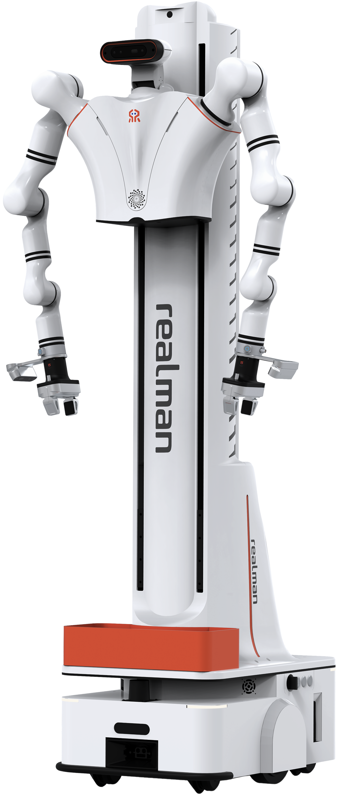

# RealMan RM75 双臂机器人 ROS1 例程包

## 一. 项目介绍

本仓库是面向 **两台七自由度 RM75 机械臂** 的 ROS1 例程包，集成机械臂驱动、双臂控制、移动底盘、视觉传感器、头部舵机、MoveIt 配置和 Gazebo 仿真。



代码版本：`V1.1.2`

### 系统组成

| 模块 | 说明 |
| --- | --- |
| 机械臂模块 | 两台 RM75-B 七自由度机械臂，支持单臂控制和双臂协同控制 |
| 移动底盘模块 | AGV 底盘运动、导航和避障相关示例 |
| 视觉传感器模块 | Intel RealSense D435 深度相机和 USB 相机示例 |
| 头部舵机模块 | LX-224HV 舵机控制示例 |
| MoveIt / Gazebo | RM75 双臂模型、规划配置和仿真启动文件 |

### 硬件环境

| 部件 | 硬件版本 | 软件版本 |
| --- | --- | --- |
| 机械臂 | RM75-B | 控制器 V1.4.10 及以上，API V4.2.8 及以上 |
| 相机 | RealSense D435C | realsense-ros-2.3.2 |
| 主控 | Jetson Xavier NX | Ubuntu 20.04，ROS Noetic |
| 底盘 | 悟时底盘 | 参考底盘说明文档 |
| 头部舵机 | LX-224HV | 串口通信 |
| 末端工具 | RMG24 平行夹爪 / EG2-4C2 夹爪 / 灵巧手 | 依实际硬件配置选择启动文件 |

更多机械臂版本信息可参考：
https://develop.realman-robotics.com/robot/versionComparisonTable.html

## 二. 环境要求

- Ubuntu 20.04
- ROS Noetic
- MoveIt
- Gazebo
- RealSense ROS
- Python 3
- OpenCV / cv_bridge
- pyrealsense2
- ultralytics
- serial

## 三. 代码结构

```text
src
├── agv_demo
│   └── 底盘导航示例
├── camera_demo
│   ├── d435_demo
│   └── usb_camera_demo
├── dual_arm_control
│   ├── arm_control
│   ├── arm_driver
│   ├── arm_servo
│   ├── dual_arm_msgs
│   ├── dual_arm_description
│   │   └── overseas_75_b_v_description
│   ├── dual_arm_gazebo
│   │   └── dual_75B_arm_gazebo
│   └── dual_arm_moveit
│       ├── dual_75B_arm_moveit_config
│       └── dual_75B_arm_rmg24_moveit_config
├── dual_arm_robot_demo
└── servo_control
```

## 四. 编译

在工作空间根目录执行：

```bash
source /opt/ros/noetic/setup.bash
catkin build dual_arm_msgs
catkin build
source devel/setup.bash
```

如果使用 `catkin_make`：

```bash
source /opt/ros/noetic/setup.bash
catkin_make
source devel/setup.bash
```

## 五. 常用启动方式

### 1. 启动 RM75 双臂驱动

```bash
source devel/setup.bash
roslaunch arm_driver dual_arm_75_driver.launch
```

默认 IP 和端口在以下文件中配置：

```text
src/dual_arm_control/arm_driver/launch/dual_arm_75_driver.launch
```

默认参数：

| 参数 | 默认值 | 说明 |
| --- | --- | --- |
| `R_Arm_IP` | `169.254.128.19` | 右臂 IP |
| `L_Arm_IP` | `169.254.128.18` | 左臂 IP |
| `Arm_Dof` | `7` | 七自由度 |
| `Arm_Type` | `RM75` | 机械臂型号 |
| `Udp_IP` | `169.254.128.22` | UDP 主动上报目标 IP |

### 2. 启动完整机器人例程

```bash
source devel/setup.bash
roslaunch dual_arm_robot_demo dual_arm_75_robot_start.launch
```

该启动文件会拉起：

- 头部舵机
- RM75 双臂驱动
- D435 相机
- USB 相机
- AGV 底盘示例
- `use_75_demo_all.py`

### 3. 启动夹爪抓取示例

```bash
source devel/setup.bash
roslaunch dual_arm_robot_demo startlaunch_grippers.launch
```

### 4. 启动灵巧手抓取示例

```bash
source devel/setup.bash
roslaunch dual_arm_robot_demo startlaunch_hand.launch
```

### 5. 查看 RM75 机器人模型

普通末端：

```bash
source devel/setup.bash
roslaunch overseas_75_b_v_description display.launch
```

RMG24 夹爪末端：

```bash
source devel/setup.bash
roslaunch overseas_75_b_v_description display_rmg24.launch
```

### 6. 启动 MoveIt

普通末端：

```bash
source devel/setup.bash
roslaunch dual_75B_arm_moveit_config demo.launch
```

RMG24 夹爪末端：

```bash
source devel/setup.bash
roslaunch dual_75B_arm_rmg24_moveit_config demo.launch
```

### 7. 启动 Gazebo + MoveIt 仿真

普通末端：

```bash
source devel/setup.bash
roslaunch dual_75B_arm_gazebo arm_75_bringup_moveit.launch
```

RMG24 夹爪末端：

```bash
source devel/setup.bash
roslaunch dual_75B_arm_gazebo arm_75_bringup_moveit_rmg24.launch
```

### 8. 连接真实机械臂并启动 MoveIt

普通末端：

```bash
source devel/setup.bash
roslaunch dual_75B_arm_moveit_config moveit_planning_execution.launch
```

RMG24 夹爪末端：

```bash
source devel/setup.bash
roslaunch dual_75B_arm_rmg24_moveit_config moveit_planning_execution.launch
```

## 六. 说明

本仓库已整理为 RM75 专用版本。后续新增例程时，建议保持默认启动链路以 RM75 为准。
